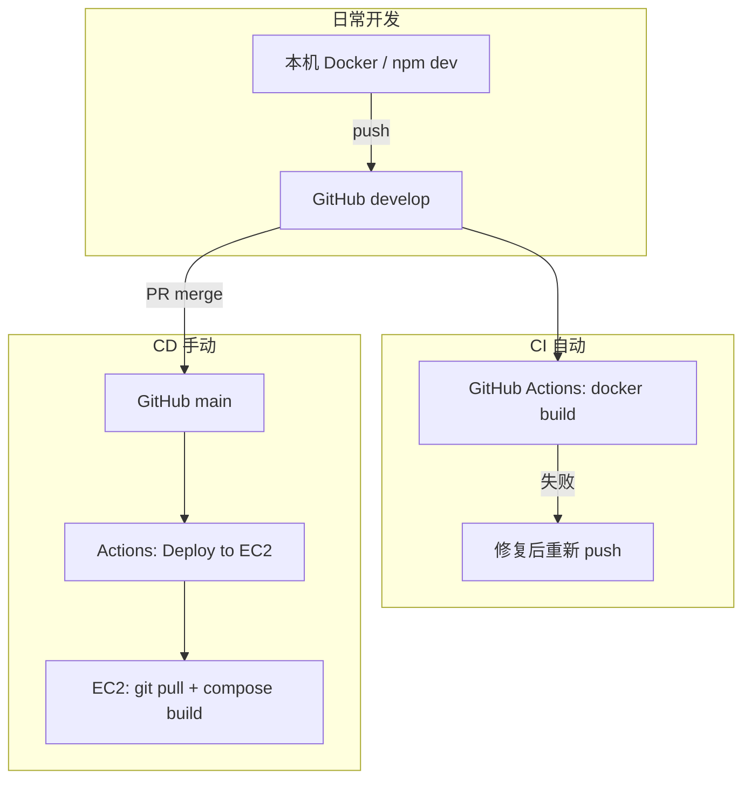

# CI/CD 与分支策略

本文说明如何在**持续开发**的同时，让云上 EC2 只跑**稳定 MVP**，以及 GitHub Actions 如何配置。

> - 本地 Docker、EC2 首次安装见 [部署说明.md](./部署说明.md)
> - **每次 push / 合并 / 上云前**见 [Push与发布规范.md](./Push与发布规范.md)（固定检查清单）

---

## 1. 总体原则

| 原则 | 说明 |
|------|------|
| **开发环境与线上分离** | 本机 / `develop` 分支日常迭代；EC2 只部署你确认可演示的版本 |
| **CI 自动、CD 手动** | 每次 push 自动 **构建校验**；**不**自动 SSH 部署到 EC2 |
| **线上跟踪 `main`** | EC2 拉取 `main`；功能稳定后 merge / PR 到 `main` 再手动部署 |
| **密钥分两类存放** | 部署凭证 → GitHub Secrets；业务配置 → EC2 本机 `.env` |

---

## 2. 分支约定

| 分支 | 用途 | 谁部署到 EC2 |
|------|------|----------------|
| `develop` | 日常功能开发、联调 | **不部署**（仅 CI build） |
| `main` | 对外演示 / MVP 稳定版 | **手动** Deploy workflow |

**推荐发布流程：**

1. 在 `develop` 完成开发与自测（本机 Docker）
2. 按 [Push与发布规范.md](./Push与发布规范.md) §2 完成 push 前检查
3. push `develop` → 等待 CI 通过（绿勾）
4. 创建 PR：`develop` → `main`，合并
5. GitHub → **Actions** → **Deploy to EC2** → **Run workflow**

**热修复：** 从 `main` 拉 `hotfix/xxx` → 修完 merge 回 `main` → 再手动 Deploy。

---

## 3. GitHub Secrets 配置

路径：**仓库 → Settings → Secrets and variables → Actions → New repository secret**

| Secret 名 | 必填 | 示例 / 说明 |
|-----------|------|-------------|
| `EC2_HOST` | 是 | EC2 **DNS 主机名**或公网 IP（如 `ec2-xx-xx-xx.ap-northeast-1.compute.amazonaws.com` 或自有域名） |
| `EC2_USER` | 是 | Amazon Linux 为 **`ec2-user`**；Ubuntu 镜像为 `ubuntu` |
| `EC2_SSH_KEY` | 是 | 下载的 `.pem` 私钥**全文**（含 `BEGIN` / `END` 行） |
| `EC2_APP_PATH` | 否 | 默认 `/home/ec2-user/AI_H5_Platform`（`docker-compose.yml` 所在目录） |

### 应该放在 Secrets 里的

- 仅 **SSH 部署凭证**（上面四项）

### 不要放在 Secrets、也不要提交 Git 的

留在 **EC2 服务器** 项目根目录的 `.env`（首次 SSH 手写，部署脚本**不覆盖**）：

- `JWT_SECRET`
- `LLM_RELAY_API_KEY` / `LLM_OFFICIAL_API_KEY`
- `TENCENT_CAPTCHA_*`
- `ADMIN_USERNAMES` 等

`.env` 已在 `.gitignore` 中，切勿 `git add .env`。

---

## 4. 工作流说明

仓库内已包含：

| 文件 | 触发 | 作用 |
|------|------|------|
| [`.github/workflows/ci.yml`](../.github/workflows/ci.yml) | `push` / `pull_request` → `develop`、`main` | `docker build` 校验 Dockerfile 可构建 |
| [`.github/workflows/deploy-ec2.yml`](../.github/workflows/deploy-ec2.yml) | **仅手动** `workflow_dispatch` | SSH 到 EC2，`git pull origin main` + `docker compose up -d --build` |

### 4.1 CI（每次 push）

- 在仓库根目录（含 `Dockerfile`）执行 `docker build`
- **不会**连接 EC2、不会改线上数据
- PR 到 `main` 前可先确认 CI 绿勾

### 4.2 CD（手动部署）

1. 打开 GitHub → **Actions** → **Deploy to EC2**
2. 点击 **Run workflow**（可选指定分支，默认 `main`）
3. 工作流将：
   - 用 Secrets 中的密钥 SSH 登录 EC2
   - `cd $EC2_APP_PATH`
   - `git fetch` → `checkout main` → `pull origin main`
   - `docker compose up -d --build`
   - 可选 `docker image prune -f` 释放磁盘

**注意：** 部署**不会**上传或覆盖服务器上的 `.env` 与 `./data`（compose 已挂载宿主机目录）。

---

## 5. EC2 首次准备（仅需一次）

在配置 GitHub Actions 之前，需先在 EC2 上完成首次安装（详见 [部署说明.md - AWS EC2](./部署说明.md#aws-ec2-首次部署)）：

1. 安装 Docker、Docker Compose 插件
2. `git clone` 仓库到 `~/AI_H5_Platform`
3. `cp .env.example .env` 并在服务器上编辑
4. `docker compose up -d --build` 验证可访问

此后日常更新优先使用 **Deploy to EC2** workflow，无需每次手动 SSH `git pull`。

---

## 6. 日常操作速查

| 场景 | 操作 |
|------|------|
| 继续开发 | 本机改代码 → push `develop` → 看 CI |
| 给朋友更新演示 | merge `main` → Actions 手动 **Deploy to EC2** |
| 只改 EC2 上的 API Key | SSH → 编辑 `.env` → `docker compose restart app` |
| 回滚版本 | SSH → `git checkout <tag或commit>` → `docker compose up -d --build` |
| 仅改 `.env` 不拉代码 | SSH → `docker compose up -d` 或 `restart app` |

---

## 7. 安全建议

1. EC2 安全组 **22 端口** 尽量限制为你的办公 IP，不要对 `0.0.0.0/0` 长期开放
2. 对外演示勿长期使用 `CAPTCHA_PROVIDER=mock`
3. 修改默认 `demo` / `admin` 密码
4. `JWT_SECRET` 使用 `openssl rand -hex 32` 生成
5. 定期 `docker system prune`（注意勿删 `./data` 挂载目录）

---

## 8. 后续升级（可选）

| 阶段 | 可选项 |
|------|--------|
| 域名 | Nginx 反代 80/443，见 [部署说明.md](./部署说明.md#nginx-反代与-https) |
| 自动 CD | `main` push 触发 deploy（需加 Environment 审批） |
| 预发环境 | 第二台 EC2 作 staging |
| 镜像仓库 | build 推 ECR，EC2 只 `docker pull`（减轻 EC2 构建压力） |
| 密钥托管 | AWS SSM Parameter Store 注入 `.env` |

当前 MVP 推荐维持：**单台 EC2 + 手动 CD + main 分支**。
