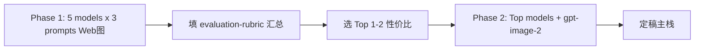

# PPT Master 多模型横评 — 操作手册

配套文件：

| 文件 | 用途 |
|------|------|
| [`model-profiles.yaml`](./model-profiles.yaml) | **切换模型**：改 `active_profile` |
| [`benchmark.env.example`](./benchmark.env.example) | 环境变量说明 |
| [`prompt-调研类.md`](./prompt-调研类.md) | 8 页调研话术 |
| [`prompt-报告类.md`](./prompt-报告类.md) | 8 页报告话术 |
| [`prompt-学术类.md`](./prompt-学术类.md) | 8 页学术话术 |
| [`evaluation-rubric.md`](./evaluation-rubric.md) | 评分维度 |
| [`results-template.md`](./results-template.md) | 单次记录空白表 |

---

## 1. 前置条件

1. 已安装 [ppt-master](https://atomgit.com/hugohe3/ppt-master)（Python 3.10+、`pip install -r requirements.txt`）
2. Cursor 打开 **`develop/ppt-master-main`** 根目录（非 H5 的 `develop` 根）
3. 已安装 PPT Master Skill：`npx skills add hugohe3/ppt-master`
4. [`develop/.env`](../../.env) 已配置：
   - `LLM_RELAY_BASE_URL` + `LLM_RELAY_API_KEY`（Gemini / Claude / GPT）
   - `base_url` + `api_key` + `model`（DeepSeek 横评专用）

---

## 2. 切换模型（唯一变量）

### 2.1 改 yaml

编辑 [`model-profiles.yaml`](./model-profiles.yaml)：

```yaml
active_profile: claude-opus-4-8   # 五选一，见下表
benchmark_phase: 1                # 1 或 2
```

| `active_profile` | Cursor Model | Base URL 读 `.env` | API Key 读 `.env` |
|------------------|--------------|--------------------|-------------------|
| `gemini-3-pro` | `gemini-3.1-pro-preview` | `LLM_RELAY_BASE_URL` | `LLM_RELAY_API_KEY` |
| `claude-opus-4-8` | `claude-opus-4-8` | 同上 | 同上 |
| `claude-opus-4-7` | `claude-opus-4-7` | 同上 | 同上 |
| `gpt-5-5` | `gpt-5.5` | 同上 | 同上 |
| `deepseek-v4-pro` | `model` | `base_url` | `api_key` |
| `gpt-image-2` | `gpt-image-2` | `LLM_RELAY_BASE_URL` | `LLM_RELAY_API_KEY` |

### 2.2 同步 Cursor Settings → Models

1. 开启 **Override OpenAI Base URL**
2. Base URL = 上表对应 env 值（须以 `/v1` 结尾）
3. OpenAI API Key = 上表对应 key
4. Add model = 上表 Model 名 → **Verify**
5. 在 Agent 模式选中该模型

### 2.3 DeepSeek 注意

若 Agent 多轮工具调用报 `reasoning_content` 400，使用 [deepseek-cursor-proxy](https://github.com/yxlao/deepseek-cursor-proxy)，Base URL 改为 `http://127.0.0.1:9000/v1`，记录中标注「需 proxy」。

### 2.4 隔离原则

- **每个 profile × 每个类型 = 新开 Agent 会话**（避免上下文污染）
- ppt-master 项目目录：`projects/benchmark-{profile}-{调研|报告|学术}-{YYYYMMDD}/`

---

## 3. 两阶段评测



### Phase 1 — 只比模型

- `benchmark_phase: 1`
- Strategist 选 **Web-sourced** 配图
- **禁止** gpt-image-2 / AI 生图
- 顺序建议：`deepseek-v4-pro` → `gemini-3-pro` → `gpt-5-5` → `claude-opus-4-7` → `claude-opus-4-8`

每个 profile 依次跑：

1. [`prompt-调研类.md`](./prompt-调研类.md)
2. [`prompt-报告类.md`](./prompt-报告类.md)
3. [`prompt-学术类.md`](./prompt-学术类.md)

### Phase 2 — 加 gpt-image-2

- 仅对 Phase 1 **总分/性价比前 2 名** profile
- `benchmark_phase: 2`
- ppt-master `.env`：`IMAGE_BACKEND=openai`，`OPENAI_API_KEY` 可用 `LLM_RELAY_API_KEY`（若中转支持）或独立 OpenAI key
- Strategist 选 **AI generation**，模型 `gpt-image-2`，quality **medium**，16:9
- 可只重跑 **报告类** 作为视觉代表，或三类全跑

---

## 4. 单次 run 检查清单

- [ ] 已改 `active_profile` 并同步 Cursor
- [ ] 已新开 Agent Chat
- [ ] 已记录开始时间
- [ ] 已粘贴完整 prompt（调研 / 报告 / 学术）
- [ ] exports 出现 `.pptx` 且 PowerPoint 可打开
- [ ] 页数为 8
- [ ] 已填 [`results-template.md`](./results-template.md) 并保存到 [`results/`](./results/)
- [ ] 已记录结束时间、路径、版式问题

---

## 5. 汇总与选型

Phase 1 结束后，对 5 个 profile 各算：

- **总分** = 三类平均分之和（见 [`evaluation-rubric.md`](./evaluation-rubric.md)）
- **性价比** = 总分 / 预估费用（USD 粗算即可）

选出 Top 1–2 进入 Phase 2。定稿后可选：H5 平台 `/admin/templates` → **从 PPT 导入**。

---

## 6. model_id 校验失败

中转返回 model not found 时：

1. 登录中转控制台查看**精确模型字符串**
2. 只改 `model-profiles.yaml` 内对应 profile 的 `model_id`
3. **不要**改 `active_profile` 键名

常见别名：`gemini-3.1-pro-preview`（profile `gemini-3-pro`）、`gpt-5.5-chat`

---

## 7. 相关文档

- [AI PPT 生成方案对比](../AI-PPT生成方案对比.md)
- [PPT Master FAQ](https://atomgit.com/hugohe3/ppt-master/blob/main/docs/faq.md)
