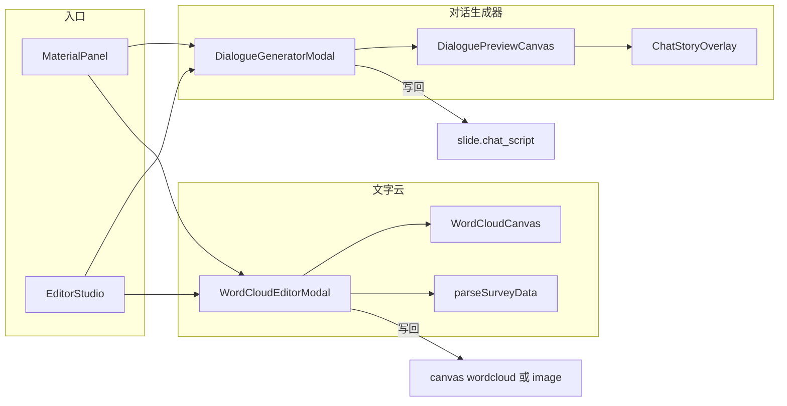

# 互动组件：对话生成器与文字云

> 最后更新：2026-05-29 · 状态：**已实现（P1）**  
> 需求追踪见 [`需求清单.md`](./需求清单.md) 第九节（DG-01~06、WC-01~06）。

对标易企秀「对话生成器」「文字云」能力，嵌入现有 H5 幻灯片编辑器：既可**全屏制作**，也可**写回当前页**并在预览/分享中播放或展示。

---

## 一、背景与目标

### 已有能力

| 模块 | 路径 | 说明 |
|------|------|------|
| 对话脚本编辑 | `ChatScriptEditor.vue` | 动效面板内：启用摘要 +「打开对话生成器」 |
| 对话播放 | `frontend/src/components/ChatStoryOverlay.vue` | 预览/分享：微信气泡逐句弹出，翻页门控 |
| 数据存储 | `slides.chat_script_json` | `enabled`、`autoAdvanceMs`、`messages[]` |
| 旗舰模板 | `backend/data/h5_templates/story-wechat-mobile*.json` | 预置多轮对话脚本 |

### 差距（对标参考图）

| 能力 | 现状 | 目标 |
|------|------|------|
| 对话背景/配色 | 硬编码 `#ededed`、右泡 `#95EC69` | 多套预设 + 自定义色 |
| 时间戳 | 无 | 时间分隔条（如 `15:30`） |
| 多对话人 | 仅 left/right + 昵称 | 参与者库（用户 A/B/C + 新建） |
| 全屏编辑器 | 无 | 左预设 / 中预览 / 右样式（易企秀三栏） |
| 编辑器内预览 | 无 | 画布上可切换对话静态预览 |
| 导出图片 | 无 | 下载 PNG + 插入幻灯片 |
| 文字云 | 完全缺失 | 手动词 + 表格/文件导入 + 形状字云 |

### 产品形态（已确认）

- **对话生成器**：全屏编辑器制作 **+** 保存为幻灯片 `chat_script` 组件（两者都要）。
- **文字云**：**手动输入关键词** 与 **导入表格/文件** 两种数据来源均支持。

---

## 二、对话生成器

### 2.1 数据模型（`chat_script` 扩展，向后兼容）

旧结构 `messages[]` 在加载时由 `normalizeChatScript()` 迁移为新结构，**无需改数据库列**。

```json
{
  "enabled": true,
  "autoAdvanceMs": 0,
  "style": {
    "presetId": "wechat-blue",
    "background": "#ededed",
    "ownerTextColor": "#ffffff",
    "ownerBgColor": "#1261FF",
    "otherTextColor": "#111111",
    "otherBgColor": "#ffffff",
    "dateTextColor": "#999999",
    "avatarRadius": 4,
    "bubbleRadius": 4
  },
  "participants": [
    { "id": "p_a", "name": "用户A", "avatar": "", "useDefaultAvatar": true },
    { "id": "p_b", "name": "用户B", "avatar": "", "useDefaultAvatar": true }
  ],
  "timeline": [
    { "id": "ts1", "type": "timestamp", "text": "15:30" },
    { "id": "m1", "type": "message", "participantId": "p_owner", "side": "right", "text": "你好，易企秀。" }
  ]
}
```

| 字段 | 说明 |
|------|------|
| `style` | 背景色、主人/他人气泡与文字色、日期色、头像/气泡圆角 |
| `participants` | 参与者库；`useDefaultAvatar` 为 true 时显示昵称首字 |
| `timeline` | 有序时间线；`timestamp` 与 `message` 混排 |
| 消息左右 | 按参与者序号交替（偶数右、奇数左）；右侧气泡用 `ownerBgColor` |
| 旧 `messages[]` | 自动映射为 `timeline` + 默认两人 `participants` |

**工具模块（计划）**：`frontend/src/utils/chatScript.js`  
- `normalizeChatScript(raw)`  
- `serializeChatScript(state)`  

**样式预设（计划）**：`frontend/src/constants/chatStylePresets.js`  
- 6~8 套：蓝白、绿白、橙白、红白、紫白、黑白、深色背景等

### 2.2 UI 结构

```
┌─────────────────────────────────────────────────────────────┐
│ 对话生成器          [下载图片] [插入当前页] [关闭]              │
├──────────┬──────────────────────────────┬───────────────────┤
│ 样式预设  │      DialoguePreviewCanvas    │ 头像/气泡圆角      │
│ (缩略图)  │   (可编辑：选中、+、删除)      │ 主人/他人/日期/背景色 │
│          │                              │ 参与者管理         │
└──────────┴──────────────────────────────┴───────────────────┘
```

**计划组件**：

| 文件 | 职责 |
|------|------|
| `components/dialogue/DialogueGeneratorModal.vue` | 全屏三栏 Modal（`Teleport`） |
| `components/dialogue/DialoguePreviewCanvas.vue` | 静态完整对话渲染 + 编辑交互 |
| `components/dialogue/DialogueStylePanel.vue` | 右侧样式与参与者 |
| 重构 `ChatStoryOverlay.vue` | 复用样式函数；播放时仅 reveal `message` 类型 |

**编辑交互**（对齐参考图）：

- 选中消息块 → 上下 `+` 插入、右上角删除
- 底部 `+` 菜单：**用户 A/B/C**、**+ 新用户**、**+ 时间**
- 参与者：昵称、头像 URL、默认左右侧

### 2.3 与编辑器集成

| 入口 | 行为 |
|------|------|
| 素材面板「互动组件 → 对话生成器」 | 打开 `DialogueGeneratorModal` |
| 「插入当前页」 | 写入 `slide.chat_script` + `layout: 'chat'` + 同步 `slideBackgrounds` |
| 动效面板 | 精简为摘要 +「打开全屏编辑器」，避免双份编辑逻辑 |
| 画布工具栏 | `chat_script.enabled` 时显示「预览对话」开关（静态全量叠加） |

### 2.4 导出图片

- 依赖：`html2canvas`
- 工具：`frontend/src/utils/exportCanvasImage.js`
- **下载到电脑**：对预览区 DOM 截图
- **插入幻灯片**：data URL → 画布 `image` 元素（或后续上传 `backend/media/uploads/`）

### 2.5 播放行为（不变）

- 预览 `/preview/:id`、分享 `/s/:slug`：`ChatStoryOverlay` 逐句弹出
- `autoAdvanceMs > 0` 自动间隔；点击继续；完成后允许翻页
- `timestamp` 随上一条消息一起显示，不参与单独 reveal 步进

---

## 三、文字云

### 3.1 画布元素 `wordcloud`

扩展 `useSlideCanvas.js` / `CanvasElement.vue`，新增类型 `wordcloud`：

```json
{
  "type": "wordcloud",
  "content": {
    "words": [{ "text": "年轻人", "weight": 120 }, { "text": "性价比", "weight": 95 }],
    "shapeId": "tree",
    "customMaskUrl": "",
    "fontFamily": "system",
    "maxFontSize": 200,
    "minFontSize": 14,
    "density": "normal",
    "rotation": "random",
    "colorMode": "auto",
    "colors": [],
    "backgroundColor": "#ffffff",
    "backgroundAlpha": 1
  }
}
```

| `shapeId` | 说明 |
|-----------|------|
| `cloud` | 默认云朵形 |
| `circle` | 圆形 |
| `heart` | 心形 |
| `tree` | 圣诞树（参考易企秀） |
| `custom` | 用户上传 mask 图 |

**渲染**：`wordcloud`（wordcloud2.js）在 `<canvas>` 上布局；主题色从 `designThemes.js` 取 `auto` 配色。

### 3.2 数据来源

| 方式 | 说明 |
|------|------|
| 手动标签 | 输入词 + 可选权重；无权重时默认 50 或按出现次数 |
| 粘贴表格 | CSV/TSV/Excel 复制文本；识别「词/选项/关键词」列与「票数/人数/频次」列 |
| 上传文件 | `.csv`（`FileReader`）；`.xlsx`（`xlsx` / SheetJS） |

**解析工具（计划）**：`frontend/src/utils/parseSurveyData.js`

示例输入：

```csv
选项,票数
年轻人,120
性价比,95
文旅,80
```

输出：`words: [{ text, weight }]`，去重合并、过滤空行。

开放题长文本：Phase 1 按换行/分隔符分词 + 词频；AI 抽词为 Phase 3 增强。

### 3.3 UI 结构

```
┌─────────────────────────────────────────────────────────────┐
│ 文字云              [刷新预览] [下载] [插入幻灯片] [关闭]       │
├──────────┬──────────────────────────────┬───────────────────┤
│ 形状素材  │      WordCloud Canvas         │ 关键词 / 导入      │
│ 云/圆/树  │      (实时预览)               │ 字体/字号/紧密度    │
│          │                              │ 旋转/颜色/背景透明度  │
└──────────┴──────────────────────────────┴───────────────────┘
```

**计划组件**：

| 文件 | 职责 |
|------|------|
| `components/wordcloud/WordCloudEditorModal.vue` | 全屏编辑器 |
| `components/wordcloud/WordCloudRenderer.js` | wordcloud2 封装 |
| `constants/wordCloudShapes.js` | 内置 mask / shape 函数 |

**插入幻灯片**：

1. **矢量模式**（默认）：保存 `wordcloud` 元素，可再编辑  
2. **栅格模式**：canvas 转 PNG → `image` 元素，分享体积更小  

---

## 四、架构关系



---

## 五、后端与依赖

### 后端（最小改动）

| 项 | 说明 |
|----|------|
| `chat_script_json` | JSON 自由扩展，API 透传，无需迁移列 |
| 模板 seed | 可选：旗舰模板改用新 `timeline` 格式 |
| 素材上传（Phase 2.5） | `POST /api/v1/素材/上传` → `backend/media/uploads/` |

### 前端新依赖（计划）

| 包 | 用途 |
|----|------|
| `html2canvas` | 对话/字云导出 PNG |
| `wordcloud` | Canvas 文字云布局 |
| `xlsx` | Excel 问卷导入（可选，与 CSV 同期或略后） |

---

## 六、实施分期

| 阶段 | 内容 | 预估 |
|------|------|------|
| **Phase 1** | `chatScript` 模型 + 预设 + `DialoguePreviewCanvas` + `DialogueGeneratorModal` + 重构 `ChatStoryOverlay` + 素材面板接入 + 导出图 | 5~7 天 |
| **Phase 2** | `wordcloud` 元素 + `parseSurveyData` + `WordCloudEditorModal` + 形状 mask + 插入幻灯片 | 5~7 天 |
| **Phase 3** | 素材库上传 API、开放题 AI 抽词、自定义 mask 上传 | 按需 |

### 风险与缓解

| 风险 | 缓解 |
|------|------|
| 中文字云布局稀疏 | 调 `gridSize`、提高 weight 倍数、限制词数 |
| 树形 mask 效果差 | 预置高质量 PNG mask |
| canvas_json 存大图过大 | 默认矢量 wordcloud；大图走上传 API |
| 两套对话 UI 分叉 | 全屏为主，侧栏仅摘要 + 跳转 |

---

## 七、验收标准

### 对话生成器（DG）

1. 素材面板可打开全屏对话生成器  
2. 可选预设背景/配色，自定义主人/他人/日期/背景色  
3. 可添加 ≥3 参与者、时间戳、多轮消息  
4. 「插入当前页」后预览/分享样式与编辑器一致，逐句播放正常  
5. 可下载 PNG 或插入为画布图片  
6. 旧 `story-wechat-mobile` 模板打开不报错、播放正常  

### 文字云（WC）

1. 素材面板可打开全屏文字云编辑器  
2. 手动添加关键词 + 粘贴问卷统计表均可生成预览  
3. 可选至少 4 种形状（云/圆/心/树）  
4. 「刷新预览」后字号随 weight 变化  
5. 「插入幻灯片」后可拖动缩放；矢量模式可再次打开编辑  
6. 上传 CSV 文件可解析（xlsx 可与 Phase 2 同期交付）  

---

## 八、相关文件索引

| 类型 | 路径 |
|------|------|
| 现有对话编辑 | `frontend/src/components/ChatScriptEditor.vue` |
| 现有对话播放 | `frontend/src/components/ChatStoryOverlay.vue` |
| 素材面板 | `frontend/src/components/MaterialPanel.vue` |
| 编辑器主控 | `frontend/src/views/EditorStudio.vue` |
| 画布元素 | `frontend/src/composables/useSlideCanvas.js` |
| 设计主题 | `frontend/src/constants/designThemes.js` |
| 微信对话规范 | `docs/reference-frames/README.md` |
