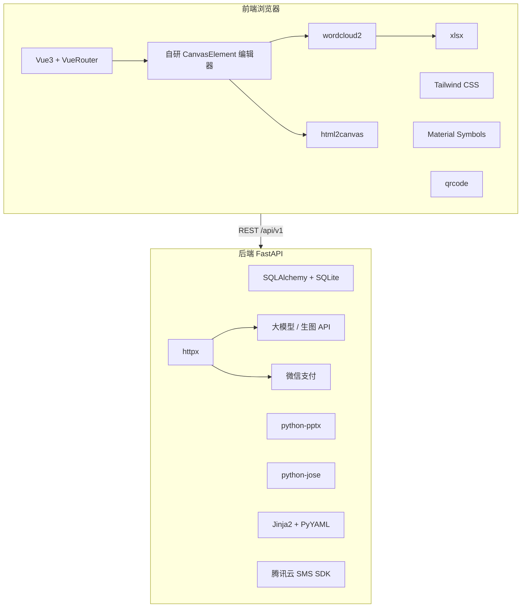

# 外部依赖与插件说明

本文档汇总 **AI 智能 H5 演示平台**（`develop/`）当前使用的第三方库、外部服务，以及它们在本项目中的用途。  
版本以 [`frontend/package.json`](../frontend/package.json) 与 [`backend/requirements.txt`](../backend/requirements.txt) 为准。

---

## 一、先说明：画布不是 Fabric.js / Konva

本项目**没有**使用 Fabric.js、Konva、Chart.js、ECharts 等「一体化画布/图表引擎」。

| 能力 | 实现方式 |
|------|----------|
| 幻灯片编辑器（文本/形状/图片/表格/图标） | **自研**：`CanvasElement.vue` + `EditorPhoneCanvas.vue`，DOM 绝对定位 + 自写拖拽/缩放/选区 |
| 图表（柱状/饼图、图表卡组） | **自研**：`SimpleChart.vue`、`ChartStack.vue`，CSS + SVG |
| 文字云 | **开源库** [`wordcloud`](https://github.com/timdream/wordcloud2.js)（npm 包名 `wordcloud`），在 `<canvas>` 上布局 |
| 对话/字云导出 PNG | **开源库** [`html2canvas`](https://github.com/niklasvh/html2canvas)，把 DOM 栅格化为图片 |
| 图片裁切 | **浏览器原生** `Canvas 2D API`（`cropImage.js`） |

数据模型为每页 `canvas_elements` JSON 数组，存于 `slides.canvas_json` 与浏览器 `localStorage`，与上述渲染层解耦。

---

## 二、前端生产依赖（npm `dependencies`）

### 1. Vue 3 — 核心 UI 框架

| 项 | 说明 |
|----|------|
| **包名** | `vue` ^3.5 |
| **官网** | https://vuejs.org |
| **许可** | MIT |
| **为何使用** | 整站 SPA：生成向导、编辑器三栏、结果页纵览、管理后台、预览播放均基于 Vue 3 Composition API |
| **本项目用法** | 组件化页面（如 `DeckEditorWorkspace`、`ResultSlidesOverview`）、`ref`/`computed` 状态、组合式函数（`useDeckEditor`、`useSlideCanvas`） |
| **可扩展能力** | 单文件组件、Teleport、异步组件；生态含 Vue Router、Pinia 等（本项目路由用 vue-router，未引入 Pinia） |

---

### 2. Vue Router — 前端路由

| 项 | 说明 |
|----|------|
| **包名** | `vue-router` ^4.5 |
| **官网** | https://router.vuejs.org |
| **许可** | MIT |
| **为何使用** | 多页面路径：`/create/generate`、`/editor/:publicId`、`/preview/:publicId`、管理端等；支持路由守卫（如生成结果页 `requiresGenerateResult`、数字 id → `public_id` 重定向） |
| **本项目用法** | [`router/index.js`](../frontend/src/router/index.js) 定义路由表与导航守卫 |

---

### 3. html2canvas — DOM 转位图

| 项 | 说明 |
|----|------|
| **包名** | `html2canvas` ^1.4 |
| **GitHub** | https://github.com/niklasvh/html2canvas |
| **许可** | MIT |
| **为何使用** | 将已渲染的 HTML（对话气泡预览、文字云预览等）导出为 PNG，供下载或插入画布 |
| **本项目用法** | [`exportCanvasImage.js`](../frontend/src/utils/exportCanvasImage.js) 动态 `import`，`captureElement()` → `toDataURL` / 下载 |
| **开源能力** | 对任意 DOM 子树截图；可配置 `scale`、`backgroundColor`、`useCORS`（跨域图） |

---

### 4. wordcloud（wordcloud2.js）— Canvas 文字云

| 项 | 说明 |
|----|------|
| **包名** | `wordcloud` ^1.2（即 wordcloud2.js） |
| **GitHub** | https://github.com/timdream/wordcloud2.js |
| **许可** | MIT |
| **为何使用** | 按词频在二维画布上碰撞布局文字，支持旋转、mask 形状（云/心/圆等） |
| **本项目用法** | [`WordCloudRenderer.js`](../frontend/src/components/wordcloud/WordCloudRenderer.js) 封装 `WordCloud()`；画布元素类型 `wordcloud`；[`WordCloudEditorModal.vue`](../frontend/src/components/wordcloud/WordCloudEditorModal.vue) 编辑后写回 `canvas_elements` |
| **开源能力** | 词频权重、自定义字体/颜色/旋转、Image mask 限定形状 |

---

### 5. SheetJS（xlsx）— Excel 解析

| 项 | 说明 |
|----|------|
| **包名** | `xlsx` ^0.18 |
| **官网** | https://sheetjs.com |
| **许可** | Apache-2.0（社区版） |
| **为何使用** | 文字云/问卷数据支持用户上传 `.xlsx`，解析为词条与权重 |
| **本项目用法** | [`parseSurveyData.js`](../frontend/src/utils/parseSurveyData.js) 动态 `import('xlsx')`，`XLSX.read` → `sheet_to_csv` → 与 CSV 共用解析逻辑 |
| **开源能力** | 读写 xlsx/xls/csv；浏览器与 Node 均可用 |

---

### 6. qrcode — 二维码生成

| 项 | 说明 |
|----|------|
| **包名** | `qrcode` ^1.5 |
| **GitHub** | https://github.com/soldair/node-qrcode |
| **许可** | MIT |
| **为何使用** | 发布成功页、升级/支付页展示分享链接或支付二维码 |
| **本项目用法** | [`PublishSuccess.vue`](../frontend/src/views/PublishSuccess.vue)、[`Upgrade.vue`](../frontend/src/views/Upgrade.vue) 生成 Data URL / Canvas |
| **开源能力** | 输出 PNG/SVG/Data URL；可设纠错级别、边距 |

---

### 7. @material-symbols/font-400 — Material 图标字体

| 项 | 说明 |
|----|------|
| **包名** | `@material-symbols/font-400` |
| **来源** | Google Material Symbols（Outlined 400 字重） |
| **许可** | Apache-2.0 |
| **为何使用** | 全站统一图标：工具栏、侧栏、生成页 Tab、结果页图标栏等，无需逐枚 SVG |
| **本项目用法** | [`main.js`](../frontend/src/main.js) `import '@material-symbols/font-400/outlined.css'`；模板中 `icon_name` |
| **开源能力** | 2500+ 可变图标名；与 Google Fonts Material Symbols 一致 |

---

### 8. vue3-draggable-resizable — 拖拽缩放组件（已声明、未使用）

| 项 | 说明 |
|----|------|
| **包名** | `vue3-draggable-resizable` ^1.6 |
| **GitHub** | https://github.com/mauricius/vue-draggable-resizable |
| **许可** | MIT |
| **现状** | 在 `package.json` 中声明，**代码库内无 import**。画布拖拽/缩放由 `EditorPhoneCanvas` + `CanvasElement` **自研实现** |
| **建议** | 若确认不再需要，可在后续清理依赖；或用于简化元素选框交互时再接入 |

---

## 三、前端开发依赖（npm `devDependencies`）

| 包名 | 用途 | 官网 |
|------|------|------|
| **vite** | 开发服务器、生产构建（ESM、HMR） | https://vitejs.dev |
| **@vitejs/plugin-vue** | Vite 解析 `.vue` 单文件组件 | — |
| **tailwindcss** | 原子化 CSS（布局、颜色 token、响应式） | https://tailwindcss.com |
| **postcss** | CSS 处理管道 | — |
| **autoprefixer** | 自动添加浏览器前缀 | — |

**为何选这套：** Vite + Vue 3 为当前主流轻量栈；Tailwind 与 Material 设计 token（`primary`、`surface-container` 等）在 [`tailwind.config.js`](../frontend/tailwind.config.js) 中统一，减少手写 CSS。

---

## 四、后端 Python 依赖（`requirements.txt`）

### 4.1 Web 框架与运行时

| 包名 | 用途 | 说明 |
|------|------|------|
| **fastapi** | HTTP API 框架 | 项目/页面/AI 生成/管理端 REST；OpenAPI 文档 |
| **uvicorn[standard]** | ASGI 服务器 | Docker 入口 `uvicorn app.main:app` |
| **pydantic** / **pydantic-settings** | 请求/响应校验、`.env` 配置 | `schemas.py`、`config.py` |
| **python-multipart** | 文件上传 | PPTX 导入、图片上传 |

---

### 4.2 数据库

| 包名 | 用途 |
|------|------|
| **sqlalchemy** | ORM（`Project`、`Slide`、`User` 等） |
| **aiosqlite** | 异步 SQLite 驱动 |

数据文件默认：`backend/data/app.db`（Docker 挂载 `./data`）。

---

### 4.3 认证与安全

| 包名 | 用途 | 本项目用法 |
|------|------|------------|
| **python-jose[cryptography]** | JWT 编解码 | [`deps/auth.py`](../backend/app/deps/auth.py) 登录态 |
| **passlib[bcrypt]** | 密码哈希 | 账号密码、短信验证码存储 |
| **cryptography** | 加密原语 | jose 依赖 |

---

### 4.4 HTTP 客户端

| 包名 | 用途 |
|------|------|
| **httpx** | 异步 HTTP |

**调用场景：**

- 大模型 OpenAI 兼容接口（[`llm/provider.py`](../backend/app/services/llm/provider.py)）
- AI 生图接口（[`llm/image_provider.py`](../backend/app/services/llm/image_provider.py)）
- 微信支付 Native（[`payment/wechat_native.py`](../backend/app/services/payment/wechat_native.py)）
- 腾讯验证码校验（[`captcha/tencent_captcha.py`](../backend/app/services/captcha/tencent_captcha.py)）

---

### 4.5 文档与模板

| 包名 | 用途 |
|------|------|
| **pyyaml** | 读取 `prompts/*.yaml` 提示词模板 |
| **jinja2** | 提示词变量渲染（[`prompt_template_service.py`](../backend/app/services/prompt_template_service.py)） |

---

### 4.6 PPT 解析

| 包名 | 用途 |
|------|------|
| **python-pptx** | 解析 `.pptx` 为幻灯片 seed |

**本项目用法：** [`pptx_template_parser.py`](../backend/app/services/pptx_template_parser.py) — 用户/管理员上传 PPTX 导入项目或探索模板；提取文本、布局、部分样式，**非**完整还原 PowerPoint 动画。

**开源能力：** 读写在内存中的 Presentation；遍历 slide/shape；读文本框与简单填充色。

---

### 4.7 腾讯云 SDK

| 包名 | 用途 |
|------|------|
| **tencentcloud-sdk-python-sms** | 短信验证码发送 |

**本项目用法：** [`sms/tencent_sms.py`](../backend/app/services/sms/tencent_sms.py)（需配置 SecretId/SecretKey、签名、模板 ID）。

---

## 五、外部服务（非 npm/PyPI，但属于「外部能力」）

这些通过 **HTTP API + 环境变量** 接入，不在 `package.json` / `requirements.txt` 中作为库名出现。

| 服务 | 配置项（示例） | 用途 |
|------|----------------|------|
| **大模型中转 / 官方 API** | `LLM_RELAY_*`、`LLM_OFFICIAL_*` | 全量 deck 生成、对话脚本等；OpenAI 兼容 `chat/completions` |
| **AI 生图 API** | 同 LLM 或独立 image 配置 | 幻灯片配图、独立生图页 |
| **腾讯云短信** | 腾讯云控制台 | 登录/注册验证码 |
| **腾讯验证码** | Captcha AppId/SecretKey | 防刷 |
| **微信支付 Native** | 商户号、证书 | [`Upgrade.vue`](../frontend/src/views/Upgrade.vue) 升级 Pro |

---

## 六、基础设施与镜像

| 组件 | 说明 |
|------|------|
| **Docker** | [`Dockerfile`](../Dockerfile) 多阶段：`node:20-alpine` 构建前端 → `python:3.12-slim` 运行后端 + 静态资源 |
| **docker-compose** | 单容器 `ai-h5-platform`，映射 8080，挂载 `data/` 与 `.env` |

---

## 七、依赖关系简图

---

## 八、按功能模块查依赖

| 功能 | 主要外部依赖 |
|------|----------------|
| AI 生成演示文稿 | httpx → LLM；jinja2 + pyyaml 提示词 |
| 结果页 / 编辑器画布 | Vue 3（自研 DOM 画布）；Material Symbols |
| 文字云 | wordcloud + xlsx + 自研 `parseSurveyData` |
| 对话生成器导出图 | html2canvas |
| 图表卡组 | 自研 SimpleChart（无 Chart.js） |
| PPTX 导入 | python-pptx |
| 模板/项目/settings 持久化 | SQLAlchemy + aiosqlite |
| 登录 / JWT | python-jose + passlib |
| 发布二维码 | qrcode |
| 升级支付 | httpx → 微信；qrcode 展示 |
| 短信登录 | tencentcloud-sdk-python-sms |

---

## 九、许可与合规提示

- 上述开源库多为 **MIT / Apache-2.0**，可用于商业项目，但仍建议在发版前核对各库 `LICENSE`。
- **SheetJS（xlsx）** 社区版与 Pro 版功能不同；当前仅用于客户端解析上传 Excel，未做服务端 xlsx 写入。
- **Material Symbols** 需遵守 Google 字体/图标使用规范。
- **腾讯云、微信、大模型 API** 为商业服务，需单独签约、配置配额与密钥；**勿将密钥提交 Git**（使用 `.env`）。

---

## 十、维护建议

1. **定期审计** `npm audit` / `pip audit`（或 Dependabot）。
2. **移除未使用依赖**：`vue3-draggable-resizable` 若长期不用可从 `package.json` 删除。
3. **大版本升级**：Vue 3、Vite 6、FastAPI 升级前在 staging 跑通：生成 → 结果页 → 编辑 → 预览 → 保存。
4. **文档同步**：新增 npm/pip 依赖时更新本文档与 [`需求清单.md`](./需求清单.md) 相关条目。

---

*文档版本：2026-05-31 · 对应代码路径 `develop/frontend`、`develop/backend`*
