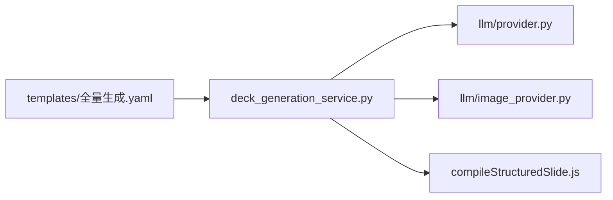

# 模块与文件映射

相关联但拆成多个文件的代码对照表，便于审计与 onboarding。

## AI 全量生成

| 文件 | 职责 |
|------|------|
| [`backend/templates/全量生成.yaml`](../backend/templates/全量生成.yaml) | LLM prompt 与 JSON schema（含 `image_intent`） |
| [`deck_generation_service.py`](../backend/app/services/deck_generation_service.py) | 解析 slides、`_collect_image_jobs` 选择性配图、入库 |
| [`llm/provider.py`](../backend/app/services/llm/provider.py) | 文稿 chat completion |
| [`llm/image_provider.py`](../backend/app/services/llm/image_provider.py) | 生图 API |
| [`compileStructuredSlide.js`](../frontend/src/utils/compileStructuredSlide.js) | 结构化 JSON → 像素 `canvas_elements`（v5） |
| [`measureTextBlock.js`](../frontend/src/utils/measureTextBlock.js) | 文本预测量 |
| [`applyProjectTheme.js`](../frontend/src/utils/applyProjectTheme.js) | 主题应用到 slides |

## 编辑器双模式

| 模式 | 视图 | 画布 | 工具栏 |
|------|------|------|--------|
| Studio | `EditorStudio.vue` | `EditorPhoneCanvas.vue` | 顶栏 `EditorCanvasToolbar.vue` |
| Result | `AiGenerateResult.vue` | `ResultSlidesOverview` → `ResultSlideCardCanvas` | 浮动 `EditorContextLayer` → `ElementQuickToolbar` |

共用：[`DeckEditorWorkspace.vue`](../frontend/src/components/DeckEditorWorkspace.vue) + [`useDeckEditor.js`](../frontend/src/composables/useDeckEditor.js)

## 浮动工具栏定位

| 文件 | 职责 |
|------|------|
| [`useElementAnchor.js`](../frontend/src/composables/useElementAnchor.js) | 跟踪选中元素 `getBoundingClientRect`，`floatingBarStyle` |
| [`ResultSlideCardCanvas.vue`](../frontend/src/components/create/ResultSlideCardCanvas.vue) | `data-editable-canvas` + `resolveElementEl`（仅 active canvas） |
| [`ResultSlidesOverview.vue`](../frontend/src/components/create/ResultSlidesOverview.vue) | 委托 card ref 解析 DOM |
| [`EditorContextLayer.vue`](../frontend/src/components/create/EditorContextLayer.vue) | Teleport 浮动栏到 body |
| [`ElementQuickToolbar.vue`](../frontend/src/components/create/ElementQuickToolbar.vue) | 文字格式 + 复制/层级/删除 |
| [`TextFormatControls.vue`](../frontend/src/components/create/TextFormatControls.vue) | 共享文字格式控件（studio/result 共用） |

## 三种 compile 入口

| 函数 | 位置 | 使用场景 |
|------|------|----------|
| `ensureSlideCompiled` | `compileStructuredSlide.js` | 结果页编辑、主题切换重编译 |
| `resolvePreviewElements` | `useSlideCanvas.js` | 播放/缩略图只读预览 |
| `compileSlideIfNeeded` | `compileStructuredSlide.js` | Preview 预加载 |

均检查 `STRUCTURED_COMPILE_VERSION` 与 viewport/theme，避免重复编译。

## 订单与支付

| 文件 | 职责 |
|------|------|
| [`commerce.py`](../backend/app/api/commerce.py) | 下单、微信回调路由 |
| [`order_service.py`](../backend/app/services/order_service.py) | 订单 CRUD、支付完成幂等 |
| [`payment/wechat_native.py`](../backend/app/services/payment/wechat_native.py) | 签名验证、解密 |
| [`quota.py`](../backend/app/services/quota.py) | 用户配额消耗 |

## Prompt 模板（三套）

| 类型 | 存储 | 服务 |
|------|------|------|
| 全量/单页 YAML | `backend/templates/*.yaml` | `prompt_template_service.py` |
| 生图模板 | DB `image_prompt_templates` | `image_prompt_template_service.py` |
| 演示文稿模板 | DB `deck_prompt_templates` | `deck_prompt_template_service.py` |

后两者 CRUD 共用 [`prompt_template_crud.py`](../backend/app/services/prompt_template_crud.py)。

## 结构化编译相关

| 文件 | 职责 |
|------|------|
| [`slideBackground.js`](../frontend/src/utils/slideBackground.js) | 背景色/渐变优先级 |
| [`CanvasElement.vue`](../frontend/src/components/CanvasElement.vue) | 元素渲染与拖拽 |
| [`PreviewSlideFrame.vue`](../frontend/src/components/PreviewSlideFrame.vue) | 只读预览帧 |

## 后端 API 路由（概览）

挂载于 `app/main.py`：`auth`, `projects`, `commerce`, `admin`, `settings`, `templates_catalog`, `layout_blocks`, `image_prompt_templates`, `deck_prompt_templates`, `standalone_image`, `bgm`, **`resume`**

## 简历模块

详设见 [`docs/简历模块/开发映射.md`](../简历模块/开发映射.md)。

| 层 | 路径 |
|----|------|
| API | `backend/app/api/resume.py` |
| 服务 | `backend/app/services/resume/` |
| OCR | `backend/app/services/ocr/paddle_provider.py` |
| 前端工作台 | `frontend/src/views/create/AiResumeWorkspace.vue` |
| 前端列表 | `frontend/src/views/ResumeList.vue` |

详细端点见各 `app/api/*.py` 文件；完整 OpenAPI 可在运行中访问 `/docs`。
