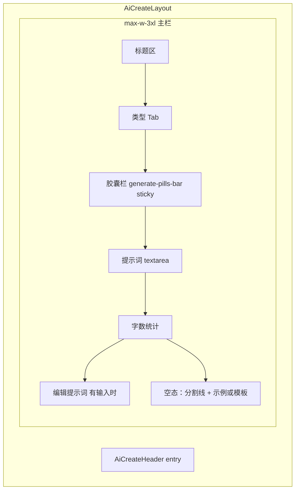
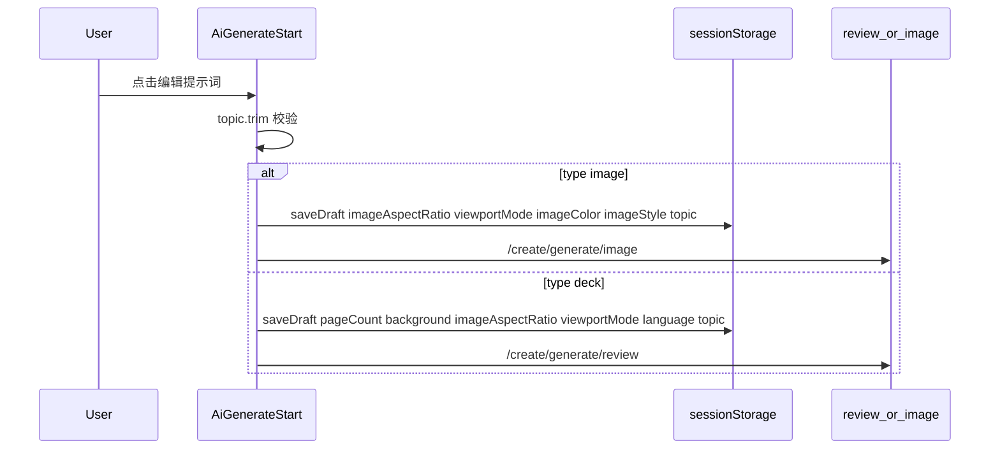

# 生成页组件与开发逻辑（`/create/generate`）

> 面向开发：说明 [`AiGenerateStart.vue`](../frontend/src/views/create/AiGenerateStart.vue) 页面各 UI 区块的职责、状态机与数据流。  
> 用户向导读见 [`AI生成向导.md`](AI生成向导.md)；按钮级说明见 [`功能开发说明书.md`](功能开发说明书.md) §2；验收见 [`生成页测试用例.md`](生成页测试用例.md)。

**路由：** `/create/generate`  
**存储：** `sessionStorage` · `ai_create_draft`（[`useAiCreateDraft.js`](../frontend/src/composables/useAiCreateDraft.js)）

---

## 1. 页面结构总览

**垂直顺序（固定）：** Tab → **胶囊（sticky）** → 输入框 → 字数 →（有输入）编辑按钮 →（空态）示例/模板。

**宽度：** 主内容区统一 `max-w-3xl`；演示文稿与生成图片 Tab **共用同一输入框宽度**。

---

## 2. 组件 / 模块清单

| 区块 | 文件 / 组件 | 职责 |
|------|-------------|------|
| 布局壳 | `AiCreateLayout.vue` | 渐变背景、顶栏、主区 `overflow-y-auto`；**不**使用 `fillHeight` 撑满视口 |
| 顶栏 | `AiCreateHeader` + `UserMenu` | 主页/工作台、欢迎文案、配额展示 |
| 类型 Tab | `AiGenerateStart` 内联 | 切换 `type`：`deck` / `image`；进入页默认 `deck` |
| Deck 比例 | `AspectRatioSelect.vue` | 与 image 共用 6 种比例（图标+数字）；`v-model` → `imageAspectRatio`，同步 `viewportMode` |
| Deck 色调/页数/语言 | 原生 `<select>` ×3 | `background`（共用 `IMAGE_COLOR_OPTIONS`）、`pageCount`、`language` |
| Image 比例 | `AspectRatioSelect.vue` | 同上 |
| Image 色调/风格 | 原生 `<select>` ×2 | `imageColor`、`imageStyle`（默认「无」） |
| 胶囊容器 | `.generate-pills-bar` | `sticky top-0`；deck/image **位置一致**，滚动时贴顶 |
| 提示词输入 | `textarea` + `resizeTopicInput` | 单行起，按 `scrollHeight` 增高；粘贴后滚顶 |
| 模板区 | `PromptTemplateCard` + composables | deck/image 空态均展示 API 模板（3 列卡片 + 预览占位） |
| 编辑按钮 | `goNext()` | 仅 `hasTopic`；写草稿并路由跳转 |

---

## 3. 状态机（Gamma 两态）

| 状态 | 条件 | 可见 UI |
|------|------|---------|
| **空态** | `!topic.trim()` | 胶囊（sticky 顶）→ 输入框 → 分割线 → deck/image **提示词模板卡片** |
| **有输入** | `topic.trim()` 非空 | 胶囊（同上，位置不变）→ 输入框 → 字数 → 居中「编辑提示词」；**隐藏**示例/模板 |

**设计原则：**

- 胶囊 **不**随有输入而下移、**不**出现在编辑按钮下方、**不**贴屏幕 viewport 最底。
- 输入框 **仅按内容增高**，无 `min-h` / `flex-1` 强制撑高。
- 短内容（如 1–2 字）保持约单行（~44px），不出现大块空白。

---

## 4. 提示词输入框（`resizeTopicInput`）

| 常量 | 值 | 说明 |
|------|-----|------|
| `TOPIC_MIN_PX` | 44 | 最小高度 |
| `TOPIC_MAX_EMPTY_PX` | 192 | 空态上限 |
| `TOPIC_MAX_FILLED_PX` | 320 | 有输入上限（与 `35vh` 取小） |

逻辑：

1. `height = auto` → 读 `scrollHeight` → `clamp(MIN, scrollHeight, maxPx)`。
2. 超出 `maxPx` 时 `overflow-y: auto`（框内滚动）。
3. `@input` / `@paste` / `watch(topic)` / `watch(hasTopic)` 触发重算。
4. 粘贴后 `scrollTop = 0`，避免光标在可视区外。

---

## 5. 类型 Tab

| Tab | `type` | 胶囊顺序 | 空态扩展区 | `goNext` 目标 |
|-----|--------|----------|------------|---------------|
| 演示文稿 | `deck` | 比例 → 色调 → 页数 → 语言 | API 模板卡片（`useDeckPromptTemplates`） | `/create/generate/review` |
| 生成图片 | `image` | 比例 → 色调 → 风格 | API 模板卡片（`useImagePromptTemplates`） | `/create/generate/image` |

- 进入页 **不恢复** 草稿中的 `type`，始终默认演示文稿。
- 切换 Tab 不清空 `topic`；胶囊区随 `type` 切换整块替换。

---

## 6. 演示文稿胶囊（deck）

| 控件 | 绑定 | 草稿字段 | 下游 |
|------|------|----------|------|
| 比例 | `imageAspectRatio` | `imageAspectRatio` + `viewportMode` | 全量生成 `viewport_mode` |
| 色调 | `background` | `background` | `background_preset`（空=不预设背景） |
| 页数 | `pageCount` | `pageCount` | `page_count` |
| 语言 | `language` | `language` | LLM `language` |

比例控件：`AspectRatioSelect.vue`（与 image Tab 相同组件与选项）。

---

## 7. 生成图片胶囊（image）

### 7.1 常量与工具 — `imageGenerateOptions.js`

| 导出 | 用途 |
|------|------|
| `IMAGE_RATIO_OPTIONS` | 6 项比例 + `iconW/H` + `viewportMode` |
| `IMAGE_COLOR_OPTIONS` | 首项「无」+ 四色；deck `background` 与 image `imageColor` 共用 |
| `IMAGE_STYLE_OPTIONS` | 首项 `{ value: '', label: '无' }` |
| `aspectRatioToViewportMode` | 横屏→`web`，其余→`mobile` |
| `aspectRatioToPresetId` | → `web-1280` / `mobile-375` |
| `enrichImagePrompt` | 生图页提交前拼「风格/色调」行（若正文未含） |
| `isValidImageStyle` | 模板 `suggestedStyle` 是否可写入风格下拉 |

**API 限制：** 后端仅 `mobile-375` / `web-1280`；6 种比例为 UI 展示，按横竖屏映射 preset。

### 7.2 比例下拉 — `AspectRatioSelect.vue`

- 触发器：圆角胶囊 + 矩形图标 + 比例文字 + chevron。
- 浮层：check + 图标 + 比例；点击外部关闭。
- `v-model`：比例字符串（如 `9:16`）。
- `ImageAspectRatioSelect.vue` 为薄包装，指向本组件。
- 用于：生成页 deck/image Tab、[`AiGenerateImage.vue`](../frontend/src/views/create/AiGenerateImage.vue) 左栏「尺寸」。

### 7.3 色调 / 风格

- 色调默认 **「无」**；选后 deck 写入 `background_preset`，image 经 `enrichImagePrompt` 拼入。
- 风格默认 **「无」**；选模板时若 `suggestedStyle` 合法 → 同步 `imageStyle`。

---

## 8. 空态扩展区

### 8.1 共享卡片 — `PromptTemplateCard.vue`

- 顶部 **4:3 预览区**：有 `preview_url` 显示缩略图，无则占位图标。
- 下方：标题、描述、要素表格（label | value）。
- 布局：`md:grid-cols-3`，小屏横向滑动（`min(78vw,14rem)`）。

### 8.2 演示文稿模板

- 数据源：[`useDeckPromptTemplates`](../frontend/src/composables/useDeckPromptTemplates.js) → `GET /api/v1/演示提示词`；fallback `DECK_PROMPT_TEMPLATES`。
- 管理端：[`AdminDeckPrompts.vue`](../frontend/src/views/admin/AdminDeckPrompts.vue) → `/api/v1/管理/演示提示词`。
- 点击：`formatDeckPromptTemplate(tpl)` 写入 `topic`。

### 8.3 生图模板

- 数据源：[`useImagePromptTemplates`](../frontend/src/composables/useImagePromptTemplates.js)（API 或 fallback）。
- 点击：`formatImagePromptTemplate(tpl)`；可选 `suggestedStyle` 联动。

---

## 9. 「编辑提示词」与草稿

**本页不调用 AI API**；仅持久化草稿并路由。

### 9.1 草稿字段（image 相关）

| 字段 | 默认 | 说明 |
|------|------|------|
| `imageAspectRatio` | `9:16` | UI 比例 |
| `viewportMode` | 由比例映射 | 兼容生图 API |
| `imageColor` | `''`（无） | 拼入 prompt 色调 |
| `background` | `''`（无） | deck `background_preset`；空则不统一铺背景 |
| `imageStyle` | `''`（无） | 拼入 prompt 风格 |

---

## 10. 下游：生图页 `AiGenerateImage.vue`

| 区块 | 逻辑 |
|------|------|
| 提示词 | 预填 `draft.topic` |
| 尺寸 | `ImageAspectRatioSelect` ← `draft.imageAspectRatio` |
| 生成 | `aspectRatioToPresetId` → `POST /api/v1/生图/独立` |
| Prompt | `enrichImagePrompt(prompt, { imageStyle, imageColor })` |

---

## 11. 关键文件索引

| 路径 | 说明 |
|------|------|
| `frontend/src/views/create/AiGenerateStart.vue` | 生成页主视图 |
| `frontend/src/views/create/AiGenerateImage.vue` | 生图两栏页 |
| `frontend/src/components/create/AiCreateLayout.vue` | 布局壳 |
| `frontend/src/components/create/AspectRatioSelect.vue` | 比例胶囊下拉 |
| `frontend/src/components/create/PromptTemplateCard.vue` | 模板卡片（含预览占位） |
| `frontend/src/constants/deckPromptTemplates.js` | deck 本地模板 fallback |
| `frontend/src/composables/useDeckPromptTemplates.js` | deck 模板 API 加载 |
| `backend/app/services/deck_prompt_template_service.py` | deck 模板 CRUD/seed |
| `frontend/src/constants/imageGenerateOptions.js` | image 选项与映射 |
| `frontend/src/constants/imagePromptTemplates.js` | 本地模板 fallback |
| `frontend/src/composables/useAiCreateDraft.js` | 草稿读写 |
| `frontend/src/composables/useImagePromptTemplates.js` | 模板 API 加载 |

---

## 12. 变更记录

| 日期 | 说明 |
|------|------|
| 2026-05-31 | Gamma 两态；image 三胶囊 + 比例图标下拉；模板三列 |
| 2026-05-31 | 双 Tab 对齐：比例+色调一致；deck 模板 API；PromptTemplateCard 预览占位 |
