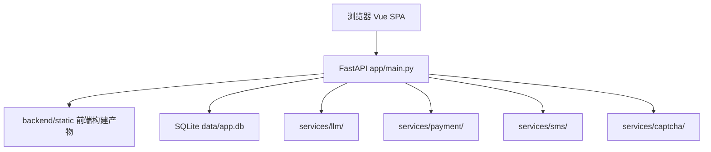
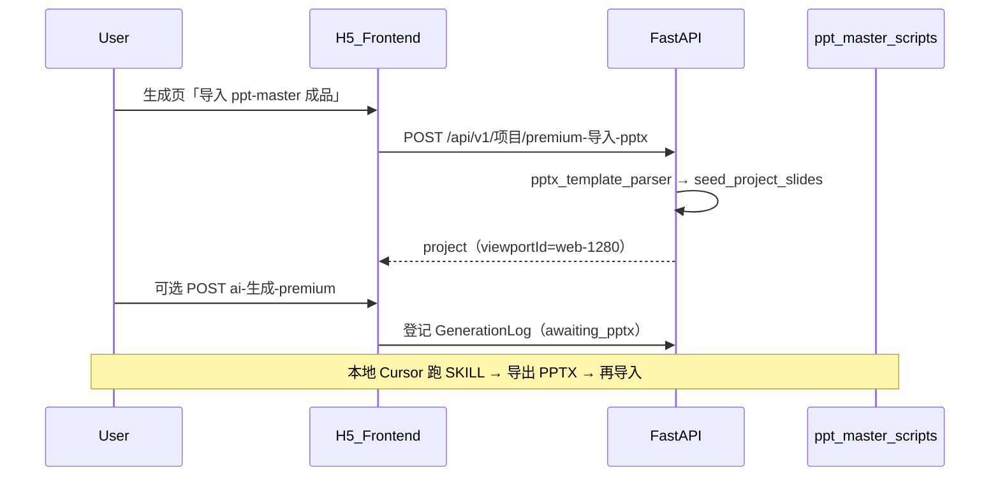

# 系统架构

本文档描述 AI 智能 H5 演示平台的运行时架构。本项目为**模块化单体**，非微服务。

## 为何采用单体

| 因素 | 说明 |
|------|------|
| MVP 阶段 | 功能迭代快，单仓库单容器部署成本低 |
| 数据存储 | SQLite 单文件，不适合多服务并发写 |
| 部署 | EC2 单 Docker 容器（见 [`部署说明.md`](部署说明.md)） |
| 团队规模 | 前后端同仓，API 与 UI 同步发布 |

支付、LLM、短信等第三方能力通过 **Provider 适配器** 解耦，但仍在同一进程内调用，不独立部署。

## 运行时拓扑

## 请求生命周期

1. 浏览器请求 `/api/v1/*` 或静态资源
2. FastAPI 路由（`app/api/*.py`）匹配端点
3. `app/deps/auth.py` 校验 JWT（需登录接口）
4. `app/deps/projects.py` 校验项目归属（项目相关接口）
5. `app/services/*.py` 执行业务逻辑
6. SQLAlchemy 读写 `app/models.py` 定义的表
7. 返回 JSON 或静态文件

## 后端分层

| 层 | 目录 | 职责 |
|----|------|------|
| API | `app/api/` | 路由、Pydantic 校验、HTTP 状态码映射 |
| Services | `app/services/` | 业务规则、编排、领域异常 |
| Deps | `app/deps/` | 鉴权、资源归属 |
| Integrations | `services/payment/`, `llm/`, `sms/`, `captcha/` | 第三方适配 |
| Data | `app/models.py`, `app/database.py` | ORM 与 SQLite 迁移 |

理想状态下 API 不含 SQL；当前 `admin.py`、`projects.py`、`auth.py` 仍有内联 CRUD，见 [`后端工程规范.md`](后端工程规范.md) 与 [`模块与文件映射.md`](模块与文件映射.md)。

## 前端架构

- **Vue 3 + Vite** SPA，构建产物输出到 `backend/static/`
- **编辑器双模式**：Studio（`EditorPhoneCanvas` + 顶栏工具栏）与 Result（`ResultSlidesOverview` + 浮动 `EditorContextLayer`）
- **结构化幻灯片**：LLM 输出 JSON → 后端配图 → 前端 `compileStructuredSlide.js` 编译为 `canvas_elements`

## H5 在线生成 vs ppt-master-main

| | H5 在线生成 | ppt-master-main |
|--|-------------|-----------------|
| 运行环境 | Docker 容器内 FastAPI | Cursor 本地 Skill |
| 输出 | 数据库 slides + 前端 canvas | 本地 `.pptx` |
| 入口 | `/create/generate` | `skills/ppt-master/SKILL.md` |
| 是否进 Docker | **是** | **否**（同仓子目录，不参与 H5 运行时） |

## Premium Deck Pipeline（Phase C）

高质量演示不走 H5 在线 fixed layout，而由 **ppt-master 导出 PPTX → H5 导入** 承载编辑与发布：

| 模块 | 路径 | 说明 |
|------|------|------|
| 导入 API | `app/api/projects.py` | `premium-导入-pptx`、`ai-生成-premium` |
| 业务服务 | `app/services/deck_premium_job.py` | 解析入库、任务登记、状态查询 |
| 前端引导 | `DeckQualityHint.vue` | `/create/generate` 演示文稿 Tab |
| 工作流 SOP | `docs/ppt-master-benchmark/h5-premium-workflow.md` | Phase A 标准流程 |
| ppt-master 根目录 | `PPT_MASTER_ROOT`（`.env`） | 默认 `develop/ppt-master-main` |

在线「快速生成」默认视口已改为 **1280×720**（`web-1280`）；宽条 `web-wide-1024` 仅作特殊场景。

## 横切关注点

- **JWT 鉴权**：`deps/auth.py`，密钥 `JWT_SECRET`
- **配额**：`services/quota.py`，生图/生成前 `check_and_consume`
- **支付**：`order_service.py` + `payment/wechat_native.py`，回调 `/api/v1/支付/回调/wechat`
- **LLM 通道**：`auto` / 中转 / 官方，配置见 `.env.example`

## 简历优化域（V1.0）

- **形态**：模块化单体内 `services/resume/` + 英文 API `/api/v1/resume/*`
- **OCR**：PaddleOCR（可选，`RESUME_PADDLEOCR_ENABLED`）；PDF 文本层用 pymupdf
- **存储**：SQLite 表 `resume_*`；文件 `data/resume/{user_id}/`
- **配额**：每次 generate/optimize 成功扣 1 次
- **详设**：[`docs/简历模块/README.md`](./简历模块/README.md)

## 相关文档

- [`模块与文件映射.md`](模块与文件映射.md) — 业务域与文件对照
- [`废弃与待清理.md`](废弃与待清理.md) — 弃用代码 registry
- [`部署说明.md`](部署说明.md) — Docker / EC2
- [`后端工程规范.md`](后端工程规范.md) — 分层约定
