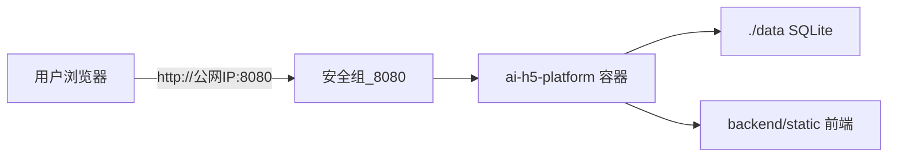

# 部署说明

本文涵盖：**本机 Docker**、**AWS EC2 公网部署**、**CI/CD**、数据持久化与常见问题。

| 文档 | 内容 |
|------|------|
| [**Push与发布规范.md**](./Push与发布规范.md) | **push 前检查清单**、分支、发布到 EC2 流程（Agent 与开发者必遵） |
| [**EC2-Docker部署计划.md**](./EC2-Docker部署计划.md) | EC2 首次部署步骤顺序表（与 Cursor Plan 同步） |
| 本文 | 环境变量、Docker、EC2 首次安装、分享链接、Nginx |
| [CI-CD与分支策略.md](./CI-CD与分支策略.md) | GitHub Actions、Secrets、develop/main 分支、手动发布 |
| [DockerHub连接失败.md](./DockerHub连接失败.md) | 国内镜像加速 |

---

## 目录

1. [本地 Docker（推荐）](#本地-docker推荐)
2. [AWS EC2 首次部署](#aws-ec2-首次部署)
3. [分享链接与外网访问](#分享链接与外网访问)
4. [日常更新与回滚](#日常更新与回滚)
5. [环境变量说明](#环境变量说明)
6. [功能冒烟与业务配置](#功能冒烟与业务配置)
7. [Nginx 反代与 HTTPS](#nginx-反代与-https)
8. [数据持久化](#数据持久化)
9. [常见问题](#常见问题)

---

## 本地 Docker（推荐）

**适用：** 本机开发、自测、给朋友临时演示（需内网穿透或端口映射）。

```bash
# 在项目根目录（含 Dockerfile、docker-compose.yml）
cp .env.example .env
docker compose up -d --build
```

访问 http://localhost:8080

- 首次使用：在登录页用**邮箱注册/登录**（`CAPTCHA_PROVIDER=mock` 时勾选「我已完成验证」）
- 管理员：在 `.env` 配置 `ADMIN_USERNAMES=你的邮箱` 后，用该邮箱登录 → `/admin`
- 管理员在 `/settings` 修改的配置会写入宿主机 `.env`（compose 已挂载）

### 国内 Docker Hub 较慢

```bash
docker compose -f docker-compose.yml -f docker-compose.cn.yml up -d --build
```

或 Windows：`.\scripts\start-local.ps1` — 详见 [DockerHub连接失败.md](./DockerHub连接失败.md)

### 说明

- 前端依赖在 **镜像构建阶段** `npm install`，宿主机不必单独装 Node
- 构建产物在镜像内 `backend/static/`，由 uvicorn 一并提供
- 纯前端改动：执行 `docker compose up -d --build` 后刷新浏览器
- 数据库与模板：启动时 sync `backend/data/h5_templates/*.json` 到 SQLite（挂载 `./data`）
- 仅改 `.env`：`docker compose up -d` 或 `docker compose restart app`（无需 `--build`）

---

## AWS EC2 首次部署

**适用：** 云上 MVP，朋友通过 **公网 IP:8080** 访问（无需域名）。

### 架构



应用容器监听 `0.0.0.0:8080`（见 `Dockerfile`）。数据与配置通过 compose 挂载到宿主机，重建容器不丢库。

### 1. 创建 EC2 实例

| 项 | 建议 |
|----|------|
| 系统 | **Amazon Linux 2023**（默认用户 `ec2-user`）或 Ubuntu 22.04（用户 `ubuntu`） |
| 规格 | **t3.small** 及以上（2GB 内存）；首次 `docker build` 较吃内存，1GB 易 OOM |
| 磁盘 | ≥ 20GB |
| 密钥 | 创建并下载 `.pem`，用于 SSH |

**安全组入站规则：**

| 类型 | 端口 | 来源 | 说明 |
|------|------|------|------|
| SSH | 22 | **你的公网 IP**/32 | 仅自己管理；勿长期对全网开放 |
| 自定义 TCP | **8080** | `0.0.0.0/0` | 对外访问平台（测试用；有域名后可改 80/443） |

分配 **弹性公网 IP**（可选但推荐），避免实例重启后 IP 变化导致分享链接失效。

### 2. SSH 登录并安装 Docker

```bash
# Amazon Linux（默认用户 ec2-user）
ssh -i your-key.pem ec2-user@<EC2_DNS或公网IP>

# Ubuntu 镜像则用户名为 ubuntu
# ssh -i your-key.pem ubuntu@<EC2_DNS或公网IP>
```

`EC2_HOST`（GitHub Secret）可填 **公有 DNS**（如 `ec2-xx-xx-xx.region.compute.amazonaws.com`）或弹性 IP / 自有域名，不必强制用数字 IP。

Amazon Linux 2023：

```bash
sudo dnf update -y
sudo dnf install -y git
curl -fsSL https://get.docker.com | sudo sh
sudo usermod -aG docker ec2-user
# 退出 SSH 重新登录，使 docker 组生效
sudo mkdir -p /usr/local/lib/docker/cli-plugins
sudo curl -SL https://github.com/docker/compose/releases/latest/download/docker-compose-linux-$(uname -m) -o /usr/local/lib/docker/cli-plugins/docker-compose
sudo chmod +x /usr/local/lib/docker/cli-plugins/docker-compose
docker compose version
```

Ubuntu 22.04（若使用 Ubuntu 镜像）：

```bash
sudo apt update && sudo apt install -y git
curl -fsSL https://get.docker.com | sudo sh
sudo usermod -aG docker ubuntu
# 退出 SSH 重新登录
sudo apt install -y docker-compose-plugin
docker compose version
```

若启用 `ufw`：`sudo ufw allow 22 && sudo ufw allow 8080`

### 3. 克隆代码并配置环境

```bash
git clone https://github.com/Peng525/AI_H5_Platform.git
cd AI_H5_Platform
git checkout main   # 线上 MVP 跟踪稳定分支；日常开发在 develop，见 CI/CD 文档

cp .env.example .env
nano .env           # 或 vim
```

**EC2 对外最小必改：**

```env
JWT_SECRET=<openssl rand -hex 32 生成>
ADMIN_USERNAMES=admin@你的邮箱.com

# 内测可 mock；对外长期演示建议改 tencent（见下文「腾讯云拼图」）
CAPTCHA_PROVIDER=mock

# AI 功能按需
LLM_RELAY_BASE_URL=...
LLM_RELAY_API_KEY=...
# 管理端充值外链（可选；余额在中转站控制台登录查看）
RELAY_DASHBOARD_RECHARGE_URL=https://once-cf.novai.su/wallet
```

生成 JWT：

```bash
openssl rand -hex 32
```

收款码（可选）：复制到 `backend/pay_assets/wechat-pay-qr.png`（compose 已挂载，不会被前端 build 清空）。

### 4. 构建并启动

```bash
docker compose up -d --build
```

- 首次构建约 5～15 分钟
- 查看日志：`docker compose logs -f app`
- 实例内自检：`curl -I http://127.0.0.1:8080`
- 浏览器：**`http://<EC2_DNS或公网IP>:8080`**

### 5. 配置 GitHub 自动部署（可选）

首次手动部署成功后，可按 [CI-CD与分支策略.md](./CI-CD与分支策略.md) 配置：

1. GitHub Secrets：
   - `EC2_HOST` = EC2 **公有 DNS** 或域名（与 SSH 主机名一致）
   - `EC2_USER` = **`ec2-user`**（Amazon Linux）
   - `EC2_SSH_KEY` = `.pem` 私钥全文
2. 可选 `EC2_APP_PATH`：`/home/ec2-user/AI_H5_Platform`
3. 之后 merge 到 `main` → Actions → **Deploy to EC2** 手动发布

---

## 分享链接与外网访问

分享 URL 由前端 `window.location.origin` 生成（`PublishSuccess.vue`）。

| 访问方式 | 分享链接形态 | 朋友能否打开 |
|----------|--------------|--------------|
| `localhost:8080` 发布 | `http://localhost:8080/s/xxx` | **不能**（仅你本机） |
| `http://<DNS或IP>:8080` 发布 | `http://<DNS或IP>:8080/s/xxx` | **能**（需安全组放行 8080） |

**正确步骤：**

1. 浏览器地址栏用 **`http://<EC2_DNS或域名>:8080`** 打开（不要用 localhost）
2. 登录 → 编辑 → **发布**
3. 复制分享页链接，应为 `http://<EC2_DNS或域名>:8080/s/xxxx`
4. 若曾在本地发布过，需在 EC2 上**重新发布**一次

---

## 日常更新与回滚

### 方式 A：GitHub Actions（推荐）

见 [CI-CD与分支策略.md](./CI-CD与分支策略.md)：`develop` 开发 → merge `main` → 手动 **Deploy to EC2**。

### 方式 B：SSH 手动

```bash
ssh -i your-key.pem ec2-user@<EC2_DNS或公网IP>
cd ~/AI_H5_Platform
git fetch origin
git checkout main
git pull origin main
docker compose up -d --build
```

仅改 `.env`：`docker compose restart app`

### 回滚

```bash
cd ~/AI_H5_Platform
git log --oneline -5
git checkout <commit或tag>
docker compose up -d --build
```

`./data` 与 `.env` 在宿主机，回滚代码**不会**自动清数据库。

---

## 环境变量说明

复制 `.env.example` 为 `.env`。完整字段见 `.env.example` 注释。

### 个人用户最小配置

无需微信商户号、无需短信：

```env
JWT_SECRET=随机长字符串
CAPTCHA_PROVIDER=mock
ADMIN_USERNAMES=你的管理员邮箱
WECHAT_PERSONAL_QR_URL=/static/wechat-pay-qr.png
```

收款码：`backend/pay_assets/wechat-pay-qr.png`

### 密钥存放原则

| 位置 | 放什么 |
|------|--------|
| EC2 本机 `.env` | JWT、LLM API Key、验证码密钥等业务配置 |
| GitHub Secrets | 仅 EC2 SSH 部署凭证（`EC2_HOST` 等） |
| **切勿** | 将 `.env` 提交到 Git |

### 简历模块

- 环境变量：`RESUME_MAX_PER_USER`、`RESUME_MAX_FILE_MB`、`RESUME_RETENTION_DAYS`、`RESUME_DATA_DIR`、`RESUME_PADDLEOCR_ENABLED`、`RESUME_PADDLEOCR_LANG` 等见 `.env.example`（与 `backend/app/config.py` 字段一一对应）
- 默认 `RESUME_PADDLEOCR_ENABLED=false`：PDF 走 pymupdf 文本层提取；**图片类附件 OCR 需启用 PaddleOCR**
- 开启 `RESUME_PADDLEOCR_ENABLED=true` 时：需在运行环境额外安装 `paddleocr` + `paddlepaddle`（Docker 镜像体积显著增大，V1 生产默认可不启用）
- 列表缩略图：依赖 Pillow + `fonts-noto-cjk`（Dockerfile 已包含），无需 PaddleOCR
- 用户文件目录：`data/resume/`（随 `data/` 卷持久化）
- API 文档：运行后 `/docs` 搜索 tag `resume`
- **升级 RS3/V2 后需重启后端**：启动时会执行 SQLite 列迁移（如 `resume_versions.visual_document_json`）；热更新未重启可能导致选模板创建简历 500

---

## 功能冒烟与业务配置

### 六项功能冒烟（个人用户）

1. **登录**：注册/登录后默认进入 `/create/generate`（AI 生成向导）
2. **AI 演示文稿**：选演示文稿 → 配置 → 输入提示词 → 提示编辑器 → 生成 → 进入编辑器（需配置 LLM）
3. **工作台**：侧栏进入「首页」/「模板库」；顶栏「导入 PPT」上传 `.pptx`
4. **支付**：`/upgrade` → 微信扫码 → 展示收款码 → `/admin` 确认收款
5. **管理**：`/admin` 查看访问与订单趋势；待支付订单区确认收款；或在 `/admin/users` 直接改会员
6. **中转充值**：`/admin` →「前往中转平台钱包」（需配置 `RELAY_DASHBOARD_RECHARGE_URL`）；余额在中转站控制台登录查看
7. **H5 模板**：`/admin/templates` — 编辑或上传 .pptx 解析上架
8. **提示词**：`/admin/prompts`、`/admin/image-prompts`

详见 [AI生成向导.md](./AI生成向导.md)。

开发测试可用升级页「演示：跳过支付」。

### 微信个人收款码 + 后台确认

1. 收款码 → `backend/pay_assets/wechat-pay-qr.png` 或 `.env` 中 `WECHAT_PERSONAL_QR_URL`
2. 用户 `/upgrade` 扫码转账
3. 管理员 `/admin` 待支付订单 → 核对金额 → 确认收款

**安全：** 勿将 `CAPTCHA_PROVIDER=mock` 用于对外生产；保管好管理员密码。

### 腾讯云拼图（上线推荐）

1. [验证码控制台](https://console.cloud.tencent.com/captcha) 创建 Web 验证
2. `.env`：
   ```env
   CAPTCHA_PROVIDER=tencent
   TENCENT_CAPTCHA_APP_ID=你的AppId
   TENCENT_CAPTCHA_APP_SECRET_KEY=你的SecretKey
   ```

### 编辑器与发布

- 顶栏 **预览** / **发布分享**（非文件导出）→ 分享链接与二维码
- 用户菜单 → **使用帮助**（`/help`），含 FAQ 与快捷键摘要
- 登录勾选「记住邮箱并保持登录」：仅保存邮箱与 JWT，**不保存密码**
- 破坏性操作（删项目、删页、Admin 删资源、拒绝订单）均使用 **ConfirmDialog** 二次确认
- 操作反馈使用 **Toast**；页面加载失败可 **重试**（模板、发布、编辑器项目）

### AI 配图（编辑器）

1. **AI 助手** → 选择 **生图分辨率**（苹果 / 安卓 / 网页，默认与当前画布一致）
2. 填写画面描述 → **AI 生图**（按所选分辨率内容区比例生成竖屏/横屏图）
3. **原图预览** 下方选择放置方式：**适应宽度** / **填充页面** / **原始尺寸** → 添加到页面
4. 已添加图片：选中后画布工具栏可切换 **适应宽 / 填充 / 原图** 或 **裁切**（无背景颜色选项）

配置 `LLM_RELAY_*` 或 `LLM_OFFICIAL_*` 及 `LLM_IMAGE_MODEL_*`。生图 API 支持 `viewport_preset_id`、`viewport_width/height`（内容区尺寸）与 `fit_mode` 参数。

### AI 全量生成（向导）

1. 登录后默认 `/create/generate`，或工作台顶栏「新建演示」
2. 选择 **演示文稿** → 配置页数/背景/尺寸/语言 → 输入提示词 → 提示编辑器 → **生成**
3. API：`POST /api/v1/项目/ai-生成`（消耗 AI 配额，依赖文稿 LLM 通道）

详见 [AI生成向导.md](./AI生成向导.md)。

### 中转 API 充值链接（NovAI 示例）

NovAI **API 调用域**（`us.novaiapi.com`）与 **钱包控制台**（`once-cf.novai.su`）分离：

| 用途 | 配置 / 方式 |
|------|-------------|
| 调用大模型 | `LLM_RELAY_BASE_URL` + `LLM_RELAY_API_KEY`（推理令牌） |
| 查看余额 / 充值 | 浏览器登录 `once-cf.novai.su` 控制台（账号密码） |
| 管理端快捷入口 | `RELAY_DASHBOARD_RECHARGE_URL` → 仪表盘「前往中转平台钱包」 |

推理令牌**不能**调用 `/api/user/self` 查余额（会返回 `invalid access token`），属中转站正常行为；**勿**将网站登录密码写入 `.env`。

```env
LLM_RELAY_BASE_URL=https://us.novaiapi.com/v1
LLM_RELAY_API_KEY=你的推理令牌
RELAY_DASHBOARD_RECHARGE_URL=https://once-cf.novai.su/wallet
```

可选：`RELAY_NOVAI_DASHBOARD_URL=https://once-cf.novai.su`（未配置充值 URL 时用于推导 `/wallet` 链接）

后端 API：`GET /api/v1/管理/中转充值`（仅返回充值链接，不请求中转站余额接口）

### 延后：微信商户 Native + ngrok

有商户号时配置 `WECHAT_PAY_*`。个人用户默认 `wechat_qr` 即可。

### 背景音乐（BGM）

1. MP3 放入 `backend/static/bgm/`（或 `.\scripts\install-bgm.ps1`）
2. 编辑器 → 工具箱 → 音乐 → 启用并选曲
3. 列表 API：`GET /api/v1/bgm/曲目`

### 画布版式与层级

- **素材 → 版式**：叠加到当前页（不清空已有组件）
- **新建页面**：默认空白；版式从 **素材 → 版式** 叠加到当前页
- **层级**：工具栏置顶 / 置底 / 上移 / 下移
- **管理端版式**：`/admin/layouts` 点「编辑」进入 EditorStudio 可视化编辑（与 H5 模板相同流程），保存写回 `layout_blocks`

### 互动组件

工具箱 → 素材 → 互动组件：对话生成器、文字云。详见 [互动组件-对话生成器与文字云.md](./互动组件-对话生成器与文字云.md)。

功能需求见 [需求清单.md](./需求清单.md)。

---

## Nginx 反代与 HTTPS

有域名时，可在 EC2 安装 Nginx，将 80/443 反代到本机 8080：

```nginx
server {
    listen 80;
    server_name your-domain.com;

    location / {
        proxy_pass http://127.0.0.1:8080;
        proxy_set_header Host $host;
        proxy_set_header X-Real-IP $remote_addr;
        proxy_set_header X-Forwarded-For $proxy_add_x_forwarded_for;
        proxy_set_header X-Forwarded-Proto $scheme;
    }
}
```

HTTPS：使用 Certbot + Let's Encrypt。配置后：

- 安全组放行 80、443，可关闭对外 8080
- **发布分享链接时须用域名访问**，链接才会是 `https://your-domain.com/s/xxx`

---

## 数据持久化

| 路径 | 内容 |
|------|------|
| `./data` | SQLite（`app.db`）、运行时数据 |
| `./.env` | 环境变量（挂载进容器） |
| `./backend/pay_assets` | 微信收款码等 |

`docker-compose.yml` 已挂载上述目录。`docker compose up -d --build` **不会**删除 `./data`。

备份建议：定期复制 EC2 上 `~/AI_H5_Platform/data` 与 `.env`（`.env` 含密钥，妥善保管）。

---

## 常见问题

| 问题 | 处理 |
|------|------|
| 外网打不开 | 检查安全组 8080、实例公网 IP、本机 `curl 127.0.0.1:8080` |
| 分享链接是 localhost | 必须用 EC2 DNS / 域名 / 公网 IP 访问后再发布 |
| 构建 OOM | 换 t3.small+，或加 swap |
| Docker Hub 慢/失败 | `docker-compose.cn.yml` 或 [DockerHub连接失败.md](./DockerHub连接失败.md) |
| Windows 本机 8080 绑定失败 | 非进程占用，多为 Hyper-V 保留 **8019–8118**；**管理员** PowerShell 执行 `.\scripts\setup-host-port-8080.ps1`（重启 WinNAT 后 `docker compose up`） |
| 朋友 git pull 后起不来 | 需自备 `.env`（从 `.env.example` 复制），不能共用你的密钥 |
| 部署后数据库还在吗 | 在，只要未删 `./data` 目录 |
| develop 和 main 区别 | develop 日常开发；EC2 MVP 应部署 **main**，见 [CI-CD与分支策略.md](./CI-CD与分支策略.md) |

---

## 部署策略摘要（持续开发 + 云上 MVP）

```
本机 / develop ──push──► CI 自动 build（不部署 EC2）
        │
        └── 稳定后 merge main ──手动 Deploy──► EC2 公网 MVP
```

- **不是**每次 push 都自动上云
- **业务密钥**在 EC2 `.env`，**SSH 密钥**在 GitHub Secrets
- EC2 Linux + Docker Compose 对 MVP **完全够用**，无需上 K8s

详细流程见 [CI-CD与分支策略.md](./CI-CD与分支策略.md)。**每次 push 前**见 [Push与发布规范.md](./Push与发布规范.md)。
